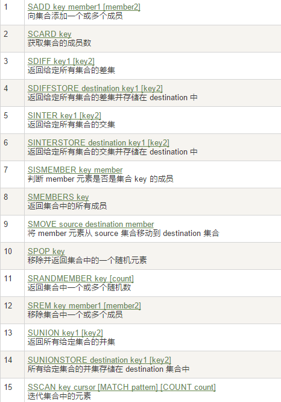

## 2.key命令和5种数据类型

### redis命令大全*

http://redisdoc.com


### 2.1 key命令

#### 2.1.1 set

设置key-value

如果key已经存在,会被覆盖

```sql
127.0.0.1:6379> set k1 v1
OK
```


#### 2.1.2  key查询相关

##### (1) keys *

查看所有key

```sql
127.0.0.1:6379> keys *
1) "k1"
```


##### (2)使用 * 表示 0 或多个字符

keys k*：查看数据库中所有以k开头的key

keys k*o：查看数据库中以h开头、以o结尾的key

```sql
127.0.0.1:6379> keys *name
1) "username"
127.0.0.1:6379> keys us*me
1) "username"
```


##### (3)2.3 使用 ？ 表示单个

keys h?o：查看数据库中所有以h开头，以o结尾、并且中间只有一个字符的key.

```sql
127.0.0.1:6379> keys *
1) "username"
2) "k1"
127.0.0.1:6379> keys user?ame
1) "username"

```


##### (4)使用[a,b,c]表示包含[]内的字符

```sql
127.0.0.1:6379> keys *
1) "adress"
2) "address"
3) "username"
4) "k1"
127.0.0.1:6379> keys ad[abcder]ress
1) "address"

```


#### 2.1.3 exists

判断key是否存在

```sql
##存在 key 返回 1，其他返回 0
127.0.0.1:6379> exists username
(integer) 1

##使用多个 key，返回存在的 key 的数量
127.0.0.1:6379> exists username address email
(integer) 2

```


#### 2.1.4 move

移动key到指定数据库实例

```sql
127.0.0.1:6379> keys *
1) "adress"
2) "address"
3) "username"
4) "k1"

## 将adress移到数据库实例2
127.0.0.1:6379> move adress 2
(integer) 1

127.0.0.1:6379> keys *
1) "address"
2) "username"
3) "k1"
127.0.0.1:6379> 

```


#### 2.1.5 key过期时间相关

##### (1) 以毫秒为单位设置key过期时间

```sql
127.0.0.1:6379> keys *
1) "address"
2) "username"
3) "k1"

##设置username的生存时间为5秒
127.0.0.1:6379> expire username 5   
(integer) 1

127.0.0.1:6379> keys *
1) "address"
2) "username"
3) "k1"
127.0.0.1:6379> keys *
1) "address"
2) "k1"
```


##### (2)  设置过期时间(UNIX时间戳)

```sql
##设置key的过期时间,时间为UNIX时间戳
127.0.0.1:6379> expireat location 1000000
(integer) 1
```


##### (3) 以秒为单位返回key剩余过期时间

以秒为单位，返回 key 的剩余生存时间（ttl: time to live） 

返回值:

● -1 ：没有设置 key 的生存时间， key 永不过期

● -2 ：key 不存在

● 数字：key 的剩余时间，秒为单位

```sql
127.0.0.1:6379> keys *
1) "readlight"
2) "address"
3) "k1"
127.0.0.1:6379> expire readlight 600
(integer) 1
## 查询readlight的剩余生存时间
127.0.0.1:6379> ttl readlight
(integer) 595
127.0.0.1:6379> ttl address
(integer) -1
127.0.0.1:6379> ttl email
(integer) -2
127.0.0.1:6379> 

```


##### (4) 以毫秒为单位返回key剩余过期时间

```sql
127.0.0.1:6379> expire k1 600
(integer) 1
## pttl,以毫秒返回key剩余过期时间 
127.0.0.1:6379> pttl k1
(integer) 596314
```


##### (5) 取消key的过期时间,key将持久保持

```sql
##设置过期时间
127.0.0.1:6379> expire k1 6000
(integer) 1
##查看key剩余生存时间
127.0.0.1:6379> ttl k1
(integer) 5988
##取消key的过期时间
127.0.0.1:6379> persist k1
(integer) 1
127.0.0.1:6379> ttl k1
(integer) -1

```


#### 2.1.6 查询key的数据类型

查看 key 所存储值的数据类型返回值：字符串表示的数据类型.

● none (key 不存在)

● string (字符串)

● list (列表)

● set (集合)

● zset (有序集)

● hash (哈希表)

```sql
127.0.0.1:6379> keys *
1) "readlight"
2) "address"
3) "k1"

##type查询key的类型
127.0.0.1:6379> type readlight
string
```


#### 2.1.7 删除key

删除存在的 key ，不存在的 key 忽略。

返回值：数字，删除的 key 的数量

```sql
127.0.0.1:6379> del readligth
(integer) 0
127.0.0.1:6379> keys *
1) "readlight"
2) "address"
3) "k1"
127.0.0.1:6379> del k1
(integer) 1
127.0.0.1:6379> keys *
1) "readlight"
2) "address"
127.0.0.1:6379> 

```


#### 2.1. 8 直接修改key名称

```sql
127.0.0.1:6379> keys *
1) "readlight"
2) "address"
127.0.0.1:6379> rename address location
OK
127.0.0.1:6379> keys *
1) "location"
2) "readlight"
```


#### 2.1.9 仅当newKey不存在时,将key修改为newKey

```sql
127.0.0.1:6379> keys *
1) "k2"
2) "k1"
3) "k3"
##直接修改key名称,不论newKey是否已经存在
127.0.0.1:6379> rename k1 k2
OK
127.0.0.1:6379> keys *
1) "k2"
2) "k3"
##如果newKey存在,则不会修改
127.0.0.1:6379> renamenx k2 k3
(integer) 0
127.0.0.1:6379> keys *
1) "k2"
2) "k3"
127.0.0.1:6379> 

```


#### 2.1.10 序列化指定key

```sql
127.0.0.1:6379> set k1 v1
OK

## dum key 序列化指定key
127.0.0.1:6379> dump k1
"\x00\x02v1\b\x00\xe6\xc8\\\xe1bI\xf3c"

127.0.0.1:6379> keys *
1) "k1"
2) "location"
```


#### 2.1.11从当前数据库随机返回一个key

```sql
127.0.0.1:6379> keys *
1) "k2"
2) "k1"
3) "k3"
127.0.0.1:6379> randomkey
"k1"
127.0.0.1:6379> randomkey
"k3"
```


#### 2.1.12 flushall清空所有key

```sql
127.0.0.1:6379> flushall
2193:M 28 Sep 08:04:08.066 * DB saved on disk
OK
```


### 2.2  string命令

string是redis最基本的类型，你可以理解成与Memcached一模一样的类型，一个key对应一个value。

string类型是二进制安全的。意思是redis的string可以包含任何数据。比如jpg图片或者序列化的对象 。

string类型是Redis最基本的数据类型，一个redis中字符串value最多可以是512M.

| key      | value |
| -------- | ----- |
| username | 张三  |


#### 2.2.1设置和获取key-value操作

##### (1)set/get 

设置/获取单个key-value

如果key已经存在,则覆盖

```sql
127.0.0.1:6379> set k4 v4 
OK
127.0.0.1:6379> get k4
"v4"
```


##### (2)mset/mget 

设置/获取多个key-value

如果key已经存在,则覆盖

```sql
127.0.0.1:6379> mset k5 v5 k6 v6
OK
127.0.0.1:6379> mget k5 k6
1) "v5"
2) "v6"
```


##### (3)setnx/get 

设置/获取单个key-value

如果key已经存在,则失败

```sql
127.0.0.1:6379> setnx k5 v5
(integer) 0
127.0.0.1:6379> get k5
"v5"
127.0.0.1:6379> setnx k7 v7
(integer) 1
127.0.0.1:6379> get k7
"v7"
```


##### (4)msetnx/mget 

设置/获取多个key-value

如果key已经存在,则整体失败

```sql
127.0.0.1:6379> msetnx k5 v5 k8 v8
(integer) 0
127.0.0.1:6379> get k8
(nil)
127.0.0.1:6379> get k5
"v5"
```


##### (5)setex

设置key时附加过期时间

```sql
127.0.0.1:6379> setex k8 10000 v8
OK
127.0.0.1:6379> get k8
"v8"
127.0.0.1:6379> ttl k8
(integer) 9992
127.0.0.1:6379> pttl k8
(integer) 9986216
```


##### (6)getset

先获取value再设置key

```sql
127.0.0.1:6379> getset k9 v9
(nil)
127.0.0.1:6379> getset k8 lalala
"v8"
127.0.0.1:6379> get k8
"lalala"
```


##### (7)strlen

获取字符串长度

```sql
##strlen key
127.0.0.1:6379> strlen k8
(integer) 6
```


##### (8)getrange/setrange

范围获取和/范围设置

获取 key 中字符串值从 start 开始 到 end 结束 的子字符串,包括 start 和 end, 负数表示从字符串的末尾开始， -1 表示最后一个字符，负下标表示自右向左.

```sql
127.0.0.1:6379> set k10 helloworld
OK
##getrange key start end
127.0.0.1:6379> getrange k10 1 3
"ell"
##setrange key offset value
127.0.0.1:6379> setrange k10 1 00000
(integer) 10
127.0.0.1:6379> get k10
"h00000orld"
```


#### 2.2.2 del

删除key-value

```sql
##del key
127.0.0.1:6379> del k10
(integer) 1
```


#### 2.2.3 append

附加

```sql
##如果key不存在,则创建,并返回key的长度
127.0.0.1:6379> append k10 hello
(integer) 5
127.0.0.1:6379> get k10 
"hello"

##如果key存在,则附加,并返回key的长度
127.0.0.1:6379> append k10 hello
(integer) 10
127.0.0.1:6379> get k10 
"hellohello"
```


#### 2.2.4incr/decr/incrby/decrby

字符串加减

只有数字格式的才能加减,不是数字会报错

incr 加1

decr减1

incrby 加指定值

decrby 减指定值

```sql
127.0.0.1:6379> set k11 11
OK
##incr key
127.0.0.1:6379> incr k11
(integer) 12
##incrby key value
127.0.0.1:6379> incrby k11 5
(integer) 17
##decrby key value
127.0.0.1:6379> decrby k11 5
(integer) 12
##decr key
127.0.0.1:6379> decr k11
(integer) 11
```


### 2.3  list操作

它是一个字符串链表，left、right都可以插入添加；
如果键不存在，创建新的链表；
如果键已存在，新增内容；
如果值全移除，对应的键也就消失了。
链表的操作无论是头和尾效率都极高，但假如是对中间元素进行操作，效率就很惨淡了。


#### 2.3.1 lpush / rpush 

创建list

lpush类似创建一个栈,先进后出,逆序

rpush类似创建一个队列,先进先出,顺序

lrange 获取指定范围list的value

0是第一个,-1是最后一个

```sql
##语法:lpush key value[value...]
127.0.0.1:6379> lpush list06 1 2 3 a b c
(integer) 6
127.0.0.1:6379> lrange list06 0 -1
1) "c"
2) "b"
3) "a"
4) "3"
5) "2"
6) "1"

##语法:rpush key value[value...]
127.0.0.1:6379> rpush list07 1 2 3  a b c
(integer) 6
127.0.0.1:6379> lrange list07 0 -1
1) "1"
2) "2"
3) "3"
4) "a"
5) "b"
6) "c"
```


#### 2.3.2 lpop / rpop 

 弹出list最左/最右值

```sql
127.0.0.1:6379> lrange list06 0 -1
1) "c"
2) "b"
3) "a"
4) "3"
5) "2"
6) "1"
##语法:lpop key
127.0.0.1:6379> lpop list06
"c"
##语法:rpop key
127.0.0.1:6379> rpop list06
"1"
```


#### 2.3.3 lindex 

访问list指定index的值

```sql
127.0.0.1:6379> lpush list01 1 2 3 4 5 6 7 8 9 10
(integer) 10
##语法:lindex key index
127.0.0.1:6379> lindex list01 0
"10"
127.0.0.1:6379> lindex list01 -1
"1"

127.0.0.1:6379> rpush list02 1 2 3 4 5 6 7 8 9 10
(integer) 10
127.0.0.1:6379> lindex list02 0
"1"
127.0.0.1:6379> lindex list02 -1
"10"
```


#### 2.3.4 llen

获取list长度

```sql
##语法:llen key
127.0.0.1:6379> llen list01
(integer) 10
127.0.0.1:6379> llen list02
(integer) 10
```


#### 2.3.5 lrem

 删除n个value

```sql
##语法:lrem key count value
127.0.0.1:6379> lrem list01 1 2
(integer) 1
127.0.0.1:6379> lrange list01 0 -1
1) "10"
2) "9"
3) "8"
4) "7"
5) "6"
6) "5"
7) "4"
8) "3"
9) "1"
```


#### 2.3.6  ltrim

截取指定范围的值再赋值给key

```sql
##语法:ltrim key start end
127.0.0.1:6379> ltrim list02 1 -2
OK
127.0.0.1:6379> lrange list02 0 -1
1) "2"
2) "3"
3) "4"
4) "5"
5) "6"
6) "7"
7) "8"
8) "9"
```


#### 2.3.7 rpoplpush 

 将一个list中的值出栈,并且添加到另一个list的最左侧

```sql
127.0.0.1:6379> lpush list03 1 2 3 4 5
(integer) 5
127.0.0.1:6379> lpush list04 6 7 8 9 10
(integer) 5
## 将list03中的1出栈,添加到list04最左侧
##语法: rpoplpush source destnation
127.0.0.1:6379> rpoplpush list03 list04
"1"
127.0.0.1:6379> lrange list04 0 -1
1) "1"
2) "10"
3) "9"
4) "8"
5) "7"
6) "6"
127.0.0.1:6379> lrange list03 0 -1
1) "5"
2) "4"
3) "3"
4) "2"
127.0.0.1:6379> 

```


#### 2.3.8 lset 

从左向右替换index上的元素

```sql
127.0.0.1:6379> lpush list5 c java c++
(integer) 3
127.0.0.1:6379> lrange list5 0 -1
1) "c++"
2) "java"
3) "c"
##将第二个位置上的元素java修改为python
##语法:lset key index value
127.0.0.1:6379> lset list5 1 python
OK
127.0.0.1:6379> lrange list5 0 -1
1) "c++"
2) "python"
3) "c"
```


#### 2.3.9 linsert

 在list某个已有值的前后再添加具体值

```sql
127.0.0.1:6379> lrange list07 0 -1
1) "1"
2) "2"
3) "3"
4) "a"
5) "b"
6) "c"

##linsert key before|after index value
127.0.0.1:6379> linsert list07 before 1 lalala
(integer) 7
127.0.0.1:6379> lrange list07 0 -1
1) "lalala"
2) "1"
3) "2"
4) "3"
5) "a"
6) "b"
7) "c"

127.0.0.1:6379> linsert list07 after 1 hihihi
(integer) 9
127.0.0.1:6379> lrange list07 0 -1
1) "lalala"
2) "1"
3) "hihihi"
4) "2"
5) "3"
6) "a"
7) "b"
8) "c"

```


### 2.4 set操作

Redis的Set是string类型的无序集合。它是通过HashTable实现实现的.

set命令表格




set是单值多value的

#### 2.4.1 sadd/smembers 

添加set/获取set值

- sadd 将一个或多个 member 元素加入到集合 key 当中，已经存在于集合的 member 元素将被忽略，不会再加入。
  - 返回值：加入到集合的新元素的个数。不包括被忽略的元素
- smembers 获取集合 key 中的所有成员元素，不存在的 key 视为空集合

```sql
#添加set
127.0.0.1:6379> sadd k1 v1
(integer) 1
#如果value已经存在则不会添加
127.0.0.1:6379> sadd k1 v1
(integer) 0
#如果value和之前的不同则添加成功
127.0.0.1:6379> sadd k1 v1 v2
(integer) 1
127.0.0.1:6379> sadd k1 v1 v2 v3
(integer) 1
#获取set的成员
127.0.0.1:6379> smembers k1
1) "v2"
2) "v1"
3) "v3"
```


#### 2.4.2.scard 

获取集合里面元素的个数

```sql
127.0.0.1:6379> scard k1
(integer) 3
```


#### 2.4.3 srem

删除集合中的元素

```sql
127.0.0.1:6379> smembers k1
1) "v2"
2) "v1"
3) "v3"
127.0.0.1:6379> srem k1 v1
(integer) 1 
127.0.0.1:6379> smembers k1
1) "v2"
2) "v3"
```


#### 2.4.4 srandmember

 随机出集合中的几个元素

 *   从set集合里面随机取出2个
 *   如果超过最大数量就全部取出，
 *   如果写的值是负数，比如-3 ，表示需要取出3个，但是可能会有重复值。

```sql
127.0.0.1:6379> sadd k1 1 2 3 4 5 6 7 8 9 10 a b c d  e f g
(integer) 17
127.0.0.1:6379> srandmember k1 5
1) "6"
2) "5"
3) "d"
4) "2"
5) "7"
```


#### 2.4.5 spop

随机弹出几个元素

```sql
127.0.0.1:6379> smembers k1
 1) "1"
 2) "d"
 3) "e"
 4) "c"
 5) "a"
 6) "3"
 7) "7"
 8) "5"
 9) "6"
10) "g"
11) "4"
12) "b"
13) "8"
14) "9"
15) "f"
16) "2"
17) "10"
127.0.0.1:6379> spop k1 5
1) "g"
2) "7"
3) "1"
4) "5"
5) "f"
127.0.0.1:6379> smembers k1
 1) "6"
 2) "4"
 3) "b"
 4) "8"
 5) "9"
 6) "a"
 7) "c"
 8) "e"
 9) "3"
10) "2"
11) "10"
12) "d"
```


#### 2.4.6 smove

将k1中的某个元素交给k2

```sql
127.0.0.1:6379> sadd k1 1 2 3 4 5
(integer) 5
127.0.0.1:6379> sadd k2 6 7 8 9 10
(integer) 5
127.0.0.1:6379> smove k1 k2 1
(integer) 1
127.0.0.1:6379> smembers k1
1) "2"
2) "3"
3) "4"
4) "5"
127.0.0.1:6379> smembers k2
1) "1"
2) "6"
3) "7"
4) "8"
5) "9"
6) "10"

#如果要转移的元素不存在,则返回0
127.0.0.1:6379> smove k1 k2 a
(integer) 0
```


#### 2.4.7sdiff/sinter/sunion

集合运算

```sql
127.0.0.1:6379> smembers k1
1) "1"
2) "2"
3) "3"
4) "4"
5) "5"
127.0.0.1:6379> smembers k2
1) "1"
2) "6"
3) "7"
4) "8"
5) "9"
6) "10"
#在第一个set里面而不在后面任何一个set里面的项
127.0.0.1:6379> sdiff k1 k2 
1) "2"
2) "3"
3) "4"
4) "5"
#交集
127.0.0.1:6379> sinter k1 k2
1) "1"
#并集
127.0.0.1:6379> sunion k1 k2
 1) "1"
 2) "2"
 3) "3"
 4) "4"
 5) "5"
 6) "6"
 7) "7"
 8) "8"
 9) "9"
10) "10"
```


#### 2.4.8 sismembers

判断 member 元素是否是集合 key 的成员,返回值：member 是集合成员返回 1，其他返回 0 

```sql
127.0.0.1:6379> sismember k1 1
(integer) 1
127.0.0.1:6379> sismember k1 b
(integer) 0
```


### 2.5  hash操作*

Redis hash 是一个 string 类型的 field 和 value 的映射表，hash 特别适合用于存储对象。

```java
class user{
    private int id;
    private String userName;
  	private String location;
    
}
```

Redis hash 是一个键值对集合。
Redis hash是一个string类型的field和value的映射表，hash特别适合用于存储对象。

类似Java里面的Map<String,Object>

redis hash 是一个 string 类型的 field 和 value 的映射表，hash 特别适合用于存储对象。

单key:field-value

   field-value

students:id-1001

​    name-zhangsan

​    age-20


k-v模式不变,但是v是一个键值对.


#### 2.5.1 hset /hmset/hsetnx

- hset:将哈希表 key 中的域 field 的值设为 value ，如果 key 不存在，则新建 hash 表，执行赋值，如果有 field ,则覆盖值。
- hmset:同时将多个 field-value (域-值)设置到哈希表 key 中，此命令会覆盖已经存在的 field，hash 表 key 不存在，创建空的 hash 表，执行 hmset.

- hsetnx:如果 key 不存在，则新建 hash 表，执行赋值，如果有 field ,则失败.

```sql
#hset key field
127.0.0.1:6379> hset user id 1
(integer) 1
127.0.0.1:6379> hset user name zhangsan
(integer) 1
127.0.0.1:6379> hset user location beijing
(integer) 1

#hmset key field[field...]
127.0.0.1:6379> hmset user2 id 2 name lisi location shanghai
OK

#hsetnx key field value
127.0.0.1:6379> hsetnx user1 id 1
(integer) 0
127.0.0.1:6379> hsetnx user2 id 2
(integer) 0
127.0.0.1:6379> hsetnx user3 id 3
(integer) 1
```


#### 2.5.2 hget/hmget/hgetall

- hget:获取哈希表 key 中给定域 field 的值,返回值：field 域的值，如果 key 不存在或者 field 不存在返回 nil.

- hmget:取哈希表 key  中一个或多个给定域的值,返回和 field 顺序对应的值，如果 field 不存在，返回 nil.

- hgetall:获取哈希表 key  中所有的域和值,以列表形式返回 hash 中域和域的值 ，key 不存在，返回空 hash.

```sql
#hget key field
127.0.0.1:6379> hget user1 id
"1"
127.0.0.1:6379> hget user2 id
"2"
127.0.0.1:6379> hget user1 name
"zhangsan"
127.0.0.1:6379> hget user2 name
"lisi"
127.0.0.1:6379> hget user1 location
"beijing"
127.0.0.1:6379> hget user2 location
"shanghai"

#hmget key field[field...]
127.0.0.1:6379> hmget user1 id name location
1) "1"
2) "zhangsan"
3) "beijing"
127.0.0.1:6379> hmget user2 id name location
1) "2"
2) "lisi"
3) "shanghai"

#hgetall key
127.0.0.1:6379> hgetall user1
1) "id"
2) "1"
3) "name"
4) "zhangsan"
5) "location"
6) "beijing"
127.0.0.1:6379> hgetall user2
1) "id"
2) "2"
3) "name"
4) "lisi"
5) "location"
6) "shanghai"
```


#### 2.5.3 hdel

删除哈希表 key 中的一个或多个指定域 field，不存在 field 直接忽略返回值：成功删除的 field 的数量

```sql
#hdel key field[field...]
127.0.0.1:6379> hdel user2 name location
(integer) 2
127.0.0.1:6379> hgetall user2
1) "id"
2) "2"
127.0.0.1:6379> 
```


#### 2.5.4 hlen


```sql
#hlen key
127.0.0.1:6379> hlen user1
(integer) 3
127.0.0.1:6379> hlen user2
(integer) 1
```


#### 2.5.5 hexists

查看哈希表 key 中，给定域 field 是否存在返回值：如果 field 存在，返回 1， 其他返回 0

```sql
127.0.0.1:6379> hgetall user1
1) "id"
2) "1"
3) "name"
4) "zhangsan"
5) "location"
6) "beijing"
127.0.0.1:6379> hexists user1 name
(integer) 1
127.0.0.1:6379> hexists user1 email
(integer) 0
```


#### 2 5.6 hkeys/hvals

- hkeys:查看哈希表 key 中的所有 field 域,返回值：包含所有 field 的列表，key 不存在返回空列表.

- hvals:返回哈希表 中所有域的值返回值：包含哈希表所有域值的列表，key 不存在返回空列表.

```sql
#hkeys key
127.0.0.1:6379> hkeys user1
1) "id"
2) "name"
3) "location"

#hvals key
127.0.0.1:6379> hvals user1
1) "1"
2) "zhangsan"
3) "beijing"
127.0.0.1:6379> 
```


#### 2.5.7 hincrby

对指定hash表中指定field值进行加法运算。

```sql
#对象指定数据域做加法,返回值为加完后的值
#hincrby key field increment
127.0.0.1:6379> hincrby user1 id 5
(integer) 6
#对非数据字段做加法报错!
127.0.0.1:6379> hincrby user1 name 5
(error) ERR hash value is not an integer
#不能加一个负数
127.0.0.1:6379> hincrby user id -5
(integer) -5
127.0.0.1:6379> hincrby user1 name -5
(error) ERR hash value is not an integer
127.0.0.1:6379> hvals user1
1) "6"
2) "zhangsan"
3) "beijing"
```


#### 2.5.8 hincrbyfloat

对指定hash表中指定field值进行浮点数加法运算。

```sql
#hincrbyfloat key field floatvalue
127.0.0.1:6379> hincrbyfloat user1 id 0.99
"6.99"
127.0.0.1:6379> hvals user1
1) "6.99"
2) "zhangsan"
3) "beijing"
```


### 2.6 zset操作

zset(sorted set：有序集合)
Redis zset 和 set 一样也是string类型元素的集合,且不允许重复的成员。
不同的是每个元素都会关联一个double类型的分数。
redis正是通过分数来为集合中的成员进行从小到大的排序。zset的成员是唯一的,但分数(score)却可以重复。

redis 有序集合zset和集合set一样也是string类型元素的集合，且不允许重复的成员。

不同的是 zset 的每个元素都会关联一个分数（分数可以重复），redis 通过分数来为集合中的成员进行从小到大的排序。分数可以重复


#### 2.6.1 zadd

将一个或多个 member 元素及其 score 值加入到有序集合 key 中，如果 member存在集合中，则更新值；score 可以是整数或浮点数.

```sql
#zadd key score member [score member…]
127.0.0.1:6379> zadd zs1 10 zhangsan 20 lisi 99 xiaoming
(integer) 3
```


#### 2.6.2 zrem

删除有序集合 key 中的一个或多个成员，不存在的成员被忽略,返回值：被成功删除的成员数量，不包括被忽略的成员。

```sql
#zrem key member [member…]
127.0.0.1:6379> zrem zs1 lisi ll
(integer) 1
127.0.0.1:6379> zrange zs1 0 -1
1) "zhangsan"
2) "xiaoming"
```


#### 2.6.3 zcard

获取有序集 key 的元素成员的个数

返回值：key 存在返回集合元素的个数， key 不存在，返回 0

```sql
#zcard key
127.0.0.1:6379> zcard zs1
(integer) 3
```


#### 2.6.4 zrange

查询有序集合，指定区间的内的元素。集合成员按 score 值从小到大来排序。 start，stop 都是从 0 开始。0 是第一个元素，1 是第二个元素，依次类推。以 -1 表示最后一个成员，-2 表示倒数第二个成员。WITHSCORES 选项让 score 和 value 一同返回。返回值：自定区间的成员集合.

```sql
127.0.0.1:6379> zadd zs1 10 zhangsan 20 lisi 99 xiaoming
(integer) 3
#zrange key start end
127.0.0.1:6379> zrange zs1 0 -1
1) "zhangsan"
2) "lisi"
3) "xiaoming"
```


#### 2.6.5 zrevrange

返回有序集 key 中，指定区间内的成员。其中成员的位置按 score 值递减(从大到小) 来排列。其它同 zrange 命令。

```sql
127.0.0.1:6379> zrange zs1 0 -1
1) "zhangsan"
2) "lisi"
3) "xiaoming"

#zrevrange key start stop [WITHSCORES]
127.0.0.1:6379> zrevrange zs1 0 -1
1) "xiaoming"
2) "lisi"
3) "zhangsan"
```


#### 2.6.6 zrangebyscore

获取有序集 key 中，所有 score 值介于 min 和 max 之间（包括 min 和 max）的成员，有序成员是按递增（从小到大）排序。

min ,max 是包括在内 ， 使用符号 ( 表示不包括。 min ， max 可以使用 -inf ,+inf 表示最小和最大.

limit 用来限制返回结果的数量和区间。

withscores 显 示 score 和 value

返回值：指定区间的集合数据

```sql
127.0.0.1:6379> zadd zs 1 a 2 b 3 c 4 d 5 e 6 f
(integer) 6
127.0.0.1:6379> zrange zs 0 -1
1) "a"
2) "b"
3) "c"
4) "d"
5) "e"
6) "f"

#zrangebyscore key mix max
127.0.0.1:6379> zrangebyscore zs 1 3 
1) "a"
2) "b"
3) "c"

#zrangebyscore key mix max withscores
127.0.0.1:6379> zrangebyscore zs 1 3 withscores 
1) "a"
2) "1"
3) "b"
4) "2"
5) "c"
6) "3"

#zrangebyscore key (mix max withscores
127.0.0.1:6379> zrangebyscore zs (1 3 withscores 
1) "b"
2) "2"
3) "c"
4) "3"

#zrangebyscore key mix (max withscores
127.0.0.1:6379> zrangebyscore zs 1 (3 withscores 
1) "a"
2) "1"
3) "b"
4) "2"
```


#### 2.6.7 zrevrangebyscore

zrevrangebyscore key max min [WITHSCORES ] [LIMIT offset count]

返回有序集 key 中， score 值介于 max 和 min 之间(默认包括等于 max 或 min )的所有的成员。有序集成员按 score 值递减(从大到小)的次序排列。其他同 zrangebyscore.

```sql
127.0.0.1:6379> zrevrange zs 0 -1 
1) "f"
2) "e"
3) "d"
4) "c"
5) "b"
6) "a"
127.0.0.1:6379> zrevrange zs 0 -1 withscores
 1) "f"
 2) "6"
 3) "e"
 4) "5"
 5) "d"
 6) "4"
 7) "c"
 8) "3"
 9) "b"
10) "2"
11) "a"
12) "1"
127.0.0.1:6379> zrevrangebyscore zs 6 3 withscores 
1) "f"
2) "6"
3) "e"
4) "5"
5) "d"
6) "4"
7) "c"
8) "3"
127.0.0.1:6379> zrevrangebyscore zs (6 3 withscores 
1) "e"
2) "5"
3) "d"
4) "4"
5) "c"
6) "3"
127.0.0.1:6379> zrevrangebyscore zs 6 (3 withscores 
1) "f"
2) "6"
3) "e"
4) "5"
5) "d"
6) "4"
127.0.0.1:6379> zrevrangebyscore zs (6 (3 withscores 
1) "e"
2) "5"
3) "d"
4) "4"
```


#### 2.6.8zcount

zcount key min max

返回有序集 key 中， score 值在 min 和 max 之间(默认包括 score 值等于 min 或 max )的成员的数量

```sql
127.0.0.1:6379> zcount zs 1 4
(integer) 4
```


#### 2.6.9 zrank

zrank key member

在获取指定有序集合中指定元素的排名（排名从0开始）

```sql
127.0.0.1:6379> zrank zs a
(integer) 0
127.0.0.1:6379> zrank zs b
(integer) 1
127.0.0.1:6379> zrank zs c
(integer) 2
```


#### 2.6.10 zscore

zscore key member

获取指定有序集合中指定元素的分数

```sql
127.0.0.1:6379> zscore zs a
"1"
127.0.0.1:6379> zscore zs b
"2"
127.0.0.1:6379> zscore zs c
"3"
```
