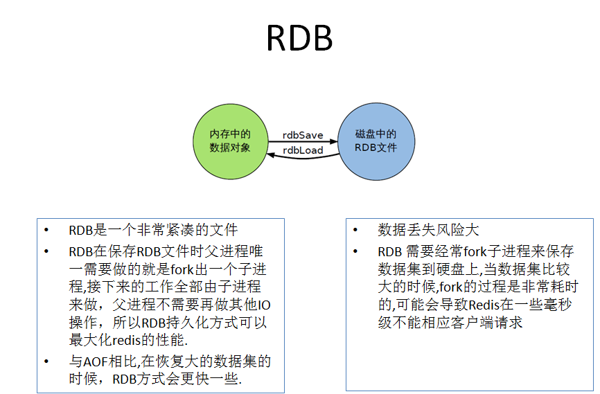

## 4.redis持久化

### 4.1 RDB

#### 4.1.1 概念

在指定的时间间隔内将内存中的数据集快照写入磁盘，也就是行话讲的Snapshot快照，它恢复时是将快照文件直接读到内存里

Redis会单独创建（fork）一个子进程来进行持久化，会先将数据写入到一个临时文件中，待持久化过程都结束了，再用这个临时文件替换上次持久化好的文件。整个过程中，主进程是不进行任何IO操作的，这就确保了极高的性能如果需要进行大规模数据的恢复，且对于数据恢复的完整性不是非常敏感，那RDB方式要比AOF方式更加的高效。RDB的缺点是最后一次持久化后的数据可能丢失。

#### 4.1.2 Fork

Fork的作用是复制一个与当前进程一样的进程。新进程的所有数据（变量、环境变量、程序计数器等）
数值都和原进程一致，但是是一个全新的进程，并作为原进程的子进程

#### 4.1.3 存储文件

Rdb 保存的是dump.rdb文件

#### 4.1.4 配置位置

#### 4.1.5 如何触发RDB快照

##### (1)配置文件中默认的快照配置

##### (2)命令save或者是bgsave

- Save：save时只管保存，其它不管，全部阻塞

- BGSAVE：Redis会在后台异步进行快照操作，
  快照同时还可以响应客户端请求。可以通过lastsave
  命令获取最后一次成功执行快照的时间

执行flushall命令，也会产生dump.rdb文件，但里面是空的，无意义

#### 4.1.6 如何恢复

将备份文件 (dump.rdb) 移动到 redis 安装目录并启动服务即可

CONFIG GET dir获取目录

#### 4.1.7 优势和劣势

优势:

- 适合大规模的数据恢复

- 对数据完整性和一致性要求不高

劣势:

- 在一定间隔时间做一次备份，所以如果redis意外down掉的话，就会丢失最后一次快照后的所有修改

- Fork的时候，内存中的数据被克隆了一份，大致2倍的膨胀性需要考虑

#### 如何停止?

动态所有停止RDB保存规则的方法：redis-cli config set save ""

### 4.2 AOF

#### 4.2.1 概念

以日志的形式来记录每个写操作，将Redis执行过的所有写指令记录下来(读操作不记录)，只许追加文件但不可以改写文件，redis启动之初会读取该文件重新构建数据，换言之，redis重启的话就根据日志文件的内容将写指令从前到后执行一次以完成数据的恢复工作.

Aof保存的是appendonly.aof文件

#### 4.2.2 配置AOF

#### 4.2.3 AOF启动/修复/恢复

##### (1)正常恢复

- 启动：设置Yes

修改默认的appendonly no，改为yes

- 恢复：

将有数据的aof文件复制一份保存到对应目录(config get dir)

重启redis然后重新加载

##### (2)异常恢复

- 启动：设置Yes

修改默认的appendonly no，改为yes

- 备份被写坏的AOF文件

- 修复:Redis-check-aof --fix进行修复

- 恢复：重启redis然后重新加载

### 4.2.4 Rewrite概念:

AOF采用文件追加方式，文件会越来越大为避免出现此种情况，新增了重写机制,当AOF文件的大小超过所设定的阈值时，Redis就会启动AOF文件的内容压缩，只保留可以恢复数据的最小指令集.可以使用命令bgrewriteaof

- 重写原理:

AOF文件持续增长而过大时，会`fork`出一条新进程来将文件重写(也是先写临时文件最后再rename)，遍历新进程的内存中数据，每条记录有一条的Set语句。重写aof文件的操作，并没有读取旧的aof文件，而是将整个内存中的数据库内容用命令的方式重写了一个新的aof文件，这点和快照有点类似

- 触发机制:

Redis会记录上次重写时的AOF大小，默认配置是当AOF文件大小是上次rewrite后大小的一倍且文件大于64M时触发

### 4.2.5AOF优势劣势

优势:

- 每修改同步：appendfsync always   同步持久化 每次发生数据变更会被立即记录到磁盘  性能较差但数据完整性比较好.

- 每秒同步：appendfsync everysec    异步操作，每秒记录   如果一秒内宕机，有数据丢失

- 不同步：appendfsync no   从不同步

劣势:

- 相同数据集的数据而言aof文件要远大于rdb文件，恢复速度慢于rdb
- Aof运行效率要慢于rdb,每秒同步策略效率较好，不同步效率和rdb相同

