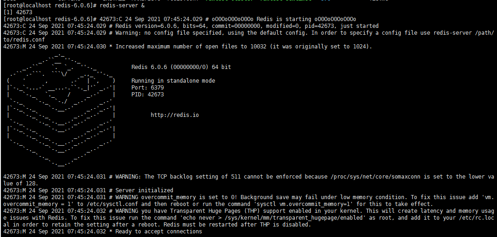

# Redis基础

## CentOS下安装redis


### 1.xshell连接centos8 [桥接模式]

防火墙命令

```
1.查看防火墙状态
systemctl status firewalld.service

2.关闭防火墙
systemctl stop firewalld.service

3.禁用防火墙
systemctl disable firewalld.service
```


ssh命令

```
1.检查是否安装openssh-server
rpm -qa |grep ssh
2.安装openssh-server
yum install openssh-server
3.开启ssh服务
systemctl start sshd.service
4.设置开机启动服务
systemctl enable sshd.service
5.检查服务状态
systemctl status sshd.service
```


查看网络信息

```
ip addr
或者
ifconfig
```


1.Linux下切换用户到root

```
#su -
```

输入root密码后可切换


2.设置IP地址、子网掩码和网关

```
#vi /etc/sysconfig/network-scripts/ifcfg-ens(网卡号)
```

修改为静态IP

```
BOOTPROTO=static
IPADDR=192.168.1.100   要与主机网段一致
NETMASK=255.255.255.0
GATEWAY=192.168.1.2
ONBOOT=yes
```


5.设置主机名(可略过)

```
#vi /etc/sysconfig/network
```

```
NETWORKING=yes
HOSTNAME=mytest01
```

```
#vim /etc/hostname
```


6.重启网络服务

```
service network restart
或者
systemctl restart network
```

出现**Failed to restart network.service: Unit network.service not found**错误的原因:

不同版本的操作系统,重启网络的命令不同

解决方法:

- 可以尝试使用以下命令：

```
service network-manager restart
```

- 如果是 Kali Linux（Debian），则需要用以下命令：

```
service networking restart
```

- 如果是Centos 8，则需要用以下命令：

```
nmcli c reload
```


### 2.安装redis

1.下载redis压缩包(redis)

2.xftp工具连接虚拟机,将redis压缩包放到`/opt/mysoftwares`目录下

3.进入`/opt/mysoftwares`目录下,解压redis到`/opt`目录

```
tar -zvxf redis.xxx.tar.gz -C /opt
```

4.进入解压目录/opt/redisxxx

```
cd /opt/redis-xxx
```

5.安装gcc编译器

```
yum -y install gcc  (联网情况下)
```

6.在/opt/redis-xxxx目录下执行make命令

```
make
```

7.执行清理上次编译

```
make distclean
```

8.再次编译

```
make
```

9.配置环境变量

```
make install
```

```
[root@localhost redis-6.0.6]# cd /
[root@localhost /]# ls
bin  boot  dev  etc  home  lib  lib64  media  mnt  opt  proc  root  run  sbin  srv  sys  tmp  usr  var
[root@localhost /]# cd usr/local/bin/
[root@localhost bin]# ls  
redis-benchmark  redis-check-aof  redis-check-rdb  redis-cli  redis-sentinel  redis-server  (这些都是redis的命令)

```


> Tips:如果make过程中出现了一堆错误:则是由于GCC与redis版本不一致造成的,更换成同一时间段的软件包即可.


### 3.启动redis

```
1.前台启动
redis-server

2.后台启动
redis-server &

3.启动时指定配置文件
redis-server redis.conf &
```




### 4.关闭rendis

```
1.通过kill杀死redis进程
  ps -ef|grep redis
  kill redis编号
  
2.通过redis命令
redis-cli shutdown

```


### 5.启动redis客户端

```
1.直接连接(默认IP:127.0.0.1  端口:6379)
redis-cli

2.指定IP和端口连接
redis-cli -h ip地址 -p 端口
```


### 6.退出redis客户端

```
1.通过关闭进程
  ps -ef|grep redis
  kill pid
  
2.在客户端执行
exit

```


### 7.redis 基础知识

```
1.测试redis性能
redis-benchmark

2.查看redis服务是否正常运行
ping   如果正常--pong

3.查看redis的统计信息
info
```

```
[root@localhost redis-6.0.6]# redis-cli
127.0.0.1:6379> ping
PONG
```

```
127.0.0.1:6379> info  (所有信息)
# Server
redis_version:6.0.6
redis_git_sha1:00000000
redis_git_dirty:0
redis_build_id:cd3585ccb8e2dce0
redis_mode:standalone
os:Linux 4.18.0-305.3.1.el8.x86_64 x86_64
arch_bits:64
multiplexing_api:epoll
atomicvar_api:atomic-builtin
gcc_version:8.4.1
process_id:42794
run_id:d4d0f0d4a6fe56857bbe050bd89619d8988c29e2
tcp_port:6379
uptime_in_seconds:777
uptime_in_days:0
hz:10
configured_hz:10
lru_clock:5095152
executable:/opt/redis-6.0.6/redis-server
config_file:

# Clients
connected_clients:51
client_recent_max_input_buffer:2
client_recent_max_output_buffer:0
blocked_clients:0
tracking_clients:0
clients_in_timeout_table:0

# Memory
used_memory:2426344
used_memory_human:2.31M
used_memory_rss:6467584
used_memory_rss_human:6.17M
used_memory_peak:4901032
used_memory_peak_human:4.67M
used_memory_peak_perc:49.51%
used_memory_overhead:1668342
used_memory_startup:801864
used_memory_dataset:758002
used_memory_dataset_perc:46.66%
allocator_allocated:2467808
allocator_active:2940928
allocator_resident:5218304
total_system_memory:1905602560
total_system_memory_human:1.77G
used_memory_lua:37888
used_memory_lua_human:37.00K
used_memory_scripts:0
used_memory_scripts_human:0B
number_of_cached_scripts:0
maxmemory:0
maxmemory_human:0B
maxmemory_policy:noeviction
allocator_frag_ratio:1.19
allocator_frag_bytes:473120
allocator_rss_ratio:1.77
allocator_rss_bytes:2277376
rss_overhead_ratio:1.24
rss_overhead_bytes:1249280
mem_fragmentation_ratio:2.71
mem_fragmentation_bytes:4083752
mem_not_counted_for_evict:0
mem_replication_backlog:0
mem_clients_slaves:0
mem_clients_normal:866286
mem_aof_buffer:0
mem_allocator:jemalloc-5.1.0
active_defrag_running:0
lazyfree_pending_objects:0

# Persistence
loading:0
rdb_changes_since_last_save:0
rdb_bgsave_in_progress:0
rdb_last_save_time:1632485062
rdb_last_bgsave_status:ok
rdb_last_bgsave_time_sec:0
rdb_current_bgsave_time_sec:-1
rdb_last_cow_size:401408
aof_enabled:0
aof_rewrite_in_progress:0
aof_rewrite_scheduled:0
aof_last_rewrite_time_sec:-1
aof_current_rewrite_time_sec:-1
aof_last_bgrewrite_status:ok
aof_last_write_status:ok
aof_last_cow_size:0
module_fork_in_progress:0
module_fork_last_cow_size:0

# Stats
total_connections_received:906
total_commands_processed:1754708
instantaneous_ops_per_sec:0
total_net_input_bytes:94706720
total_net_output_bytes:1316933403
instantaneous_input_kbps:0.00
instantaneous_output_kbps:0.00
rejected_connections:0
sync_full:0
sync_partial_ok:0
sync_partial_err:0
expired_keys:0
expired_stale_perc:0.00
expired_time_cap_reached_count:0
expire_cycle_cpu_milliseconds:20
evicted_keys:0
keyspace_hits:500000
keyspace_misses:0
pubsub_channels:0
pubsub_patterns:0
latest_fork_usec:298
migrate_cached_sockets:0
slave_expires_tracked_keys:0
active_defrag_hits:0
active_defrag_misses:0
active_defrag_key_hits:0
active_defrag_key_misses:0
tracking_total_keys:0
tracking_total_items:0
tracking_total_prefixes:0
unexpected_error_replies:0

# Replication
role:master
connected_slaves:0
master_replid:5d4a6173e3ed6265f31d1fe1adb671294e14bb7c
master_replid2:0000000000000000000000000000000000000000
master_repl_offset:0
second_repl_offset:-1
repl_backlog_active:0
repl_backlog_size:1048576
repl_backlog_first_byte_offset:0
repl_backlog_histlen:0

# CPU
used_cpu_sys:17.207496
used_cpu_user:12.715607
used_cpu_sys_children:0.005248
used_cpu_user_children:0.001544

# Modules

# Cluster
cluster_enabled:0

# Keyspace
db0:keys=4,expires=0,avg_ttl=0

```


## key命令

### 1. 设置key-value

如果key已经存在,会被覆盖

```sql
127.0.0.1:6379> set k1 v1
OK
```


### 2. key查询相关

#### 2.1 查看所有key

```sql
127.0.0.1:6379> keys *
1) "k1"
```


#### 2.2 使用 * 表示 0 或多个字符

keys k*：查看数据库中所有以k开头的key

keys k*o：查看数据库中以h开头、以o结尾的key

```sql
127.0.0.1:6379> keys *name
1) "username"
127.0.0.1:6379> keys us*me
1) "username"
```


#### 2.3 使用 ？ 表示单个

keys h?o：查看数据库中所有以h开头，以o结尾、并且中间只有一个字符的key.

```sql
127.0.0.1:6379> keys *
1) "username"
2) "k1"
127.0.0.1:6379> keys user?ame
1) "username"

```


#### 2.4 使用[a,b,c]表示包含[]内的字符

```sql
127.0.0.1:6379> keys *
1) "adress"
2) "address"
3) "username"
4) "k1"
127.0.0.1:6379> keys ad[abcder]ress
1) "address"

```


### 3. 判断key是否存在

```sql
##存在 key 返回 1，其他返回 0
127.0.0.1:6379> exists username
(integer) 1

##使用多个 key，返回存在的 key 的数量
127.0.0.1:6379> exists username address email
(integer) 2

```


### 4.移动key到指定数据库实例

```sql
127.0.0.1:6379> keys *
1) "adress"
2) "address"
3) "username"
4) "k1"

## 将adress移到数据库实例2
127.0.0.1:6379> move adress 2
(integer) 1

127.0.0.1:6379> keys *
1) "address"
2) "username"
3) "k1"
127.0.0.1:6379> 

```


### 5. key过期时间相关

#### 5.1 以毫秒为单位设置key过期时间

```sql
127.0.0.1:6379> keys *
1) "address"
2) "username"
3) "k1"

##设置username的生存时间为5秒
127.0.0.1:6379> expire username 5   
(integer) 1

127.0.0.1:6379> keys *
1) "address"
2) "username"
3) "k1"
127.0.0.1:6379> keys *
1) "address"
2) "k1"
```


#### 5.2 设置过期时间(UNIX时间戳)

```sql
##设置key的过期时间,时间为UNIX时间戳
127.0.0.1:6379> expireat location 1000000
(integer) 1
```


#### 5.3 以秒为单位返回key剩余过期时间

以秒为单位，返回 key 的剩余生存时间（ttl: time to live） 

返回值:

● -1 ：没有设置 key 的生存时间， key 永不过期

● -2 ：key 不存在

● 数字：key 的剩余时间，秒为单位

```sql
127.0.0.1:6379> keys *
1) "readlight"
2) "address"
3) "k1"
127.0.0.1:6379> expire readlight 600
(integer) 1
## 查询readlight的剩余生存时间
127.0.0.1:6379> ttl readlight
(integer) 595
127.0.0.1:6379> ttl address
(integer) -1
127.0.0.1:6379> ttl email
(integer) -2
127.0.0.1:6379> 

```


#### 5.4 以毫秒为单位返回key剩余过期时间

```sql
127.0.0.1:6379> expire k1 600
(integer) 1
## pttl,以毫秒返回key剩余过期时间 
127.0.0.1:6379> pttl k1
(integer) 596314
```


#### 5.5 取消key的过期时间,key将持久保持

```sql
##设置过期时间
127.0.0.1:6379> expire k1 6000
(integer) 1
##查看key剩余生存时间
127.0.0.1:6379> ttl k1
(integer) 5988
##取消key的过期时间
127.0.0.1:6379> persist k1
(integer) 1
127.0.0.1:6379> ttl k1
(integer) -1

```


### 6. 查询key的数据类型

查看 key 所存储值的数据类型返回值：字符串表示的数据类型.

● none (key 不存在)

● string (字符串)

● list (列表)

● set (集合)

● zset (有序集)

● hash (哈希表)

```sql
127.0.0.1:6379> keys *
1) "readlight"
2) "address"
3) "k1"

##type查询key的类型
127.0.0.1:6379> type readlight
string
```


### 7. 删除key

删除存在的 key ，不存在的 key 忽略。

返回值：数字，删除的 key 的数量

```sql
127.0.0.1:6379> del readligth
(integer) 0
127.0.0.1:6379> keys *
1) "readlight"
2) "address"
3) "k1"
127.0.0.1:6379> del k1
(integer) 1
127.0.0.1:6379> keys *
1) "readlight"
2) "address"
127.0.0.1:6379> 

```


### 8. 直接修改key名称

```sql
127.0.0.1:6379> keys *
1) "readlight"
2) "address"
127.0.0.1:6379> rename address location
OK
127.0.0.1:6379> keys *
1) "location"
2) "readlight"
```


### 9. 仅当newKey不存在时,将key修改为newKey

```sql
127.0.0.1:6379> keys *
1) "k2"
2) "k1"
3) "k3"
##直接修改key名称,不论newKey是否已经存在
127.0.0.1:6379> rename k1 k2
OK
127.0.0.1:6379> keys *
1) "k2"
2) "k3"
##如果newKey存在,则不会修改
127.0.0.1:6379> renamenx k2 k3
(integer) 0
127.0.0.1:6379> keys *
1) "k2"
2) "k3"
127.0.0.1:6379> 

```


### 10. 序列化指定key

```sql
127.0.0.1:6379> set k1 v1
OK

## dum key 序列化指定key
127.0.0.1:6379> dump k1
"\x00\x02v1\b\x00\xe6\xc8\\\xe1bI\xf3c"

127.0.0.1:6379> keys *
1) "k1"
2) "location"
```


### 11 .从当前数据库随机返回一个key

```sql
127.0.0.1:6379> keys *
1) "k2"
2) "k1"
3) "k3"
127.0.0.1:6379> randomkey
"k1"
127.0.0.1:6379> randomkey
"k3"
```


## 5种数据类型

### 1. string

string是redis最基本的类型，你可以理解成与Memcached一模一样的类型，一个key对应一个value。

string类型是二进制安全的。意思是redis的string可以包含任何数据。比如jpg图片或者序列化的对象 。

string类型是Redis最基本的数据类型，一个redis中字符串value最多可以是512M.

| key      | value |
| -------- | ----- |
| username | 张三  |


### 2. hash

Redis hash 是一个 string 类型的 field 和 value 的映射表，hash 特别适合用于存储对象。

```java
class user{
    private int id;
    private String userName;
  	private String location;
    
}
```

Redis hash 是一个键值对集合。
Redis hash是一个string类型的field和value的映射表，hash特别适合用于存储对象。


类似Java里面的Map<String,Object>


### 3. list

Redis 列表是简单的字符串列表，按照插入顺序排序。你可以添加一个元素导列表的头部（左边）或者尾部（右边）。
它的底层实际是个链表


### 4. set

Redis的Set是string类型的无序集合。它是通过HashTable实现实现的.


### 5. zset

zset(sorted set：有序集合)
Redis zset 和 set 一样也是string类型元素的集合,且不允许重复的成员。
不同的是每个元素都会关联一个double类型的分数。
redis正是通过分数来为集合中的成员进行从小到大的排序。zset的成员是唯一的,但分数(score)却可以重复。


## redis命令大全*

http://redisdoc.com


## string操作

### 1.设置和获取key-value操作

#### 1.1set/get 设置/获取单个key-value

如果key已经存在,则覆盖

```sql
127.0.0.1:6379> set k4 v4 
OK
127.0.0.1:6379> get k4
"v4"
```


#### 1.2mset/mget 设置/获取多个key-value

如果key已经存在,则覆盖

```sql
127.0.0.1:6379> mset k5 v5 k6 v6
OK
127.0.0.1:6379> mget k5 k6
1) "v5"
2) "v6"
```


#### 1.3setnx/get 设置/获取单个key-value

如果key已经存在,则失败

```sql
127.0.0.1:6379> setnx k5 v5
(integer) 0
127.0.0.1:6379> get k5
"v5"
127.0.0.1:6379> setnx k7 v7
(integer) 1
127.0.0.1:6379> get k7
"v7"
```


#### 1.4msetnx/mget 设置/获取多个key-value

如果key已经存在,则整体失败

```sql
127.0.0.1:6379> msetnx k5 v5 k8 v8
(integer) 0
127.0.0.1:6379> get k8
(nil)
127.0.0.1:6379> get k5
"v5"
```


#### 1.5setex设置key时附加过期时间

```sql
127.0.0.1:6379> setex k8 10000 v8
OK
127.0.0.1:6379> get k8
"v8"
127.0.0.1:6379> ttl k8
(integer) 9992
127.0.0.1:6379> pttl k8
(integer) 9986216
```


#### 1.6getset先获取value再设置key

```sql
127.0.0.1:6379> getset k9 v9
(nil)
127.0.0.1:6379> getset k8 lalala
"v8"
127.0.0.1:6379> get k8
"lalala"
```


#### 1.7strlen获取字符串长度

```sql
##strlen key
127.0.0.1:6379> strlen k8
(integer) 6
```


#### 1.8getrange/setrange范围获取和/范围设置

获取 key 中字符串值从 start 开始 到 end 结束 的子字符串,包括 start 和 end, 负数表示从字符串的末尾开始， -1 表示最后一个字符，负下标表示自右向左.

```sql
127.0.0.1:6379> set k10 helloworld
OK
##getrange key start end
127.0.0.1:6379> getrange k10 1 3
"ell"
##setrange key offset value
127.0.0.1:6379> setrange k10 1 00000
(integer) 10
127.0.0.1:6379> get k10
"h00000orld"
```


#### 1.9del删除key-value

```sql
##del key
127.0.0.1:6379> del k10
(integer) 1
```


#### 1.10append附加

```sql
##如果key不存在,则创建,并返回key的长度
127.0.0.1:6379> append k10 hello
(integer) 5
127.0.0.1:6379> get k10 
"hello"

##如果key存在,则附加,并返回key的长度
127.0.0.1:6379> append k10 hello
(integer) 10
127.0.0.1:6379> get k10 
"hellohello"
```


### 2.字符串加减

只有数字格式的才能加减,不是数字会报错

incr 加1

decr减1

incrby 加指定值

decrby 减指定值

```sql
127.0.0.1:6379> set k11 11
OK
##incr key
127.0.0.1:6379> incr k11
(integer) 12
##incrby key value
127.0.0.1:6379> incrby k11 5
(integer) 17
##decrby key value
127.0.0.1:6379> decrby k11 5
(integer) 12
##decr key
127.0.0.1:6379> decr k11
(integer) 11
```


## list操作

它是一个字符串链表，left、right都可以插入添加；
如果键不存在，创建新的链表；
如果键已存在，新增内容；
如果值全移除，对应的键也就消失了。
链表的操作无论是头和尾效率都极高，但假如是对中间元素进行操作，效率就很惨淡了。


### 1. lpush / rpush 创建list

lpush类似创建一个栈,先进后出,逆序

rpush类似创建一个队列,先进先出,顺序

lrange 获取指定范围list的value

0是第一个,-1是最后一个

```sql
##语法:lpush key value[value...]
127.0.0.1:6379> lpush list06 1 2 3 a b c
(integer) 6
127.0.0.1:6379> lrange list06 0 -1
1) "c"
2) "b"
3) "a"
4) "3"
5) "2"
6) "1"

##语法:rpush key value[value...]
127.0.0.1:6379> rpush list07 1 2 3  a b c
(integer) 6
127.0.0.1:6379> lrange list07 0 -1
1) "1"
2) "2"
3) "3"
4) "a"
5) "b"
6) "c"
```


### 2. lpop / rpop  弹出list最左/最右值

```sql
127.0.0.1:6379> lrange list06 0 -1
1) "c"
2) "b"
3) "a"
4) "3"
5) "2"
6) "1"
##语法:lpop key
127.0.0.1:6379> lpop list06
"c"
##语法:rpop key
127.0.0.1:6379> rpop list06
"1"
```


### 3. lindex 访问list指定index的值

```sql
127.0.0.1:6379> lpush list01 1 2 3 4 5 6 7 8 9 10
(integer) 10
##语法:lindex key index
127.0.0.1:6379> lindex list01 0
"10"
127.0.0.1:6379> lindex list01 -1
"1"

127.0.0.1:6379> rpush list02 1 2 3 4 5 6 7 8 9 10
(integer) 10
127.0.0.1:6379> lindex list02 0
"1"
127.0.0.1:6379> lindex list02 -1
"10"
```


### 4. llen获取list长度

```sql
##语法:llen key
127.0.0.1:6379> llen list01
(integer) 10
127.0.0.1:6379> llen list02
(integer) 10
```


### 5. lrem 删除n个value

```sql
##语法:lrem key count value
127.0.0.1:6379> lrem list01 1 2
(integer) 1
127.0.0.1:6379> lrange list01 0 -1
1) "10"
2) "9"
3) "8"
4) "7"
5) "6"
6) "5"
7) "4"
8) "3"
9) "1"
```


### 6. ltrim截取指定范围的值再赋值给key

```sql
##语法:ltrim key start end
127.0.0.1:6379> ltrim list02 1 -2
OK
127.0.0.1:6379> lrange list02 0 -1
1) "2"
2) "3"
3) "4"
4) "5"
5) "6"
6) "7"
7) "8"
8) "9"
```


### 7. rpoplpush  将一个list中的值出栈,并且添加到另一个list的最左侧

```sql
127.0.0.1:6379> lpush list03 1 2 3 4 5
(integer) 5
127.0.0.1:6379> lpush list04 6 7 8 9 10
(integer) 5
## 将list03中的1出栈,添加到list04最左侧
##语法: rpoplpush source destnation
127.0.0.1:6379> rpoplpush list03 list04
"1"
127.0.0.1:6379> lrange list04 0 -1
1) "1"
2) "10"
3) "9"
4) "8"
5) "7"
6) "6"
127.0.0.1:6379> lrange list03 0 -1
1) "5"
2) "4"
3) "3"
4) "2"
127.0.0.1:6379> 

```


### 8. lset 从左向右替换index上的元素

```sql
127.0.0.1:6379> lpush list5 c java c++
(integer) 3
127.0.0.1:6379> lrange list5 0 -1
1) "c++"
2) "java"
3) "c"
##将第二个位置上的元素java修改为python
##语法:lset key index value
127.0.0.1:6379> lset list5 1 python
OK
127.0.0.1:6379> lrange list5 0 -1
1) "c++"
2) "python"
3) "c"
```


### 9. linsert 在list某个已有值的前后再添加具体值

```sql
127.0.0.1:6379> lrange list07 0 -1
1) "1"
2) "2"
3) "3"
4) "a"
5) "b"
6) "c"

##linsert key before|after index value
127.0.0.1:6379> linsert list07 before 1 lalala
(integer) 7
127.0.0.1:6379> lrange list07 0 -1
1) "lalala"
2) "1"
3) "2"
4) "3"
5) "a"
6) "b"
7) "c"

127.0.0.1:6379> linsert list07 after 1 hihihi
(integer) 9
127.0.0.1:6379> lrange list07 0 -1
1) "lalala"
2) "1"
3) "hihihi"
4) "2"
5) "3"
6) "a"
7) "b"
8) "c"

```


## set操作


## hash操作


## zset操作


## redis配置文件


## redis持久化


## redis事务


## redis消息的发布与订阅


## redis主从复制


## redis哨兵


## jedis

